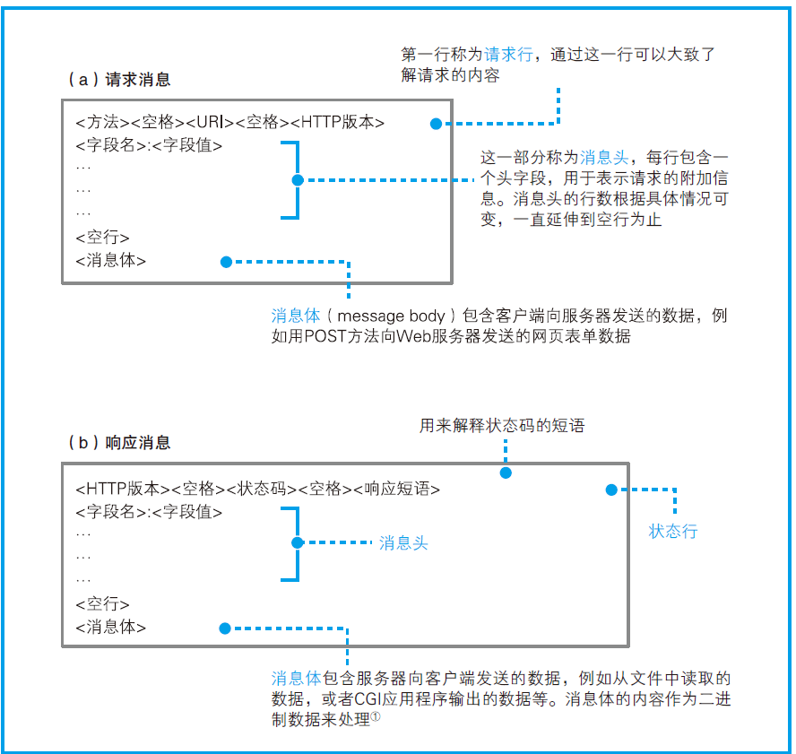

先看看大致流程：

1. 生成 HTTP 请求消息：当用户在浏览器中输入网址，浏览器就会对 URL 进行解析；然后浏览器会根据网址的含义来生成请求消息；
2. 向 DNS 服务器查询 Web 服务器的 IP 地址：请求消息生成后，浏览器向 DNS 服务器查询域名对应的 IP 地址，然后委托操作系统（浏览器本身并没有网络通讯的能力）向 Web 服务器发送请求。
3. 委托协议栈发送消息：查询到 IP 地址之后，浏览器就可以将消息委托给操作系统的协议栈（TCP/IP）发送给服务器。
4. 数字信息转换为电信号：通过协议栈将数据变成网络包后，网卡负责将数字信号转换为电信号。
5. 

## 生成 HTTP 请求消息

浏览器要做的第一步工作就是对 URL 进行解析，从而生成发送给 Web 服务器的请求消息。

### 省略文件名的情况

1. http://www.lab.glasscom.com/dir/

   以 `/` 结尾代表访问默认文件，大多数情况下是 `index.html` 或者 `default.htm` 之类的文件。

2. http://www.lab.glasscom.com

   省略结尾的 `/` 符，代表访问服务器根目录下的默认文件，也就是 `index.html` 或者 `default.htm`。

3. http://www.lab.glasscom.com/whatisthis

   如果 Web 服务器上存在名 whatisthis 的文件，则作为文件名来处理；如果存在名为 whatisthis 的目录，则作为目录名来处。
### 生成请求消息

对 URL 进行解析之后，浏览器确定了 Web 服务器和文件名，接下来就是根据这些信息来生成 HTTP 请求消息了。

## 向 DNS 服务器查询域名 IP 地址

浏览器解析完 URL 并生成请求消息后，需要委托操作系统向服务器发送请求消息。

但是在这之前，还需要知道服务器域名对应的 IP 地址。因此需要使用 DNS 服务器查询 IP 地址。

DNS 服务器保存了域名和 IP 的对应关系。

域名中用 `.` 来分隔，比如 `www.lab.glasscom.com.`，越往右层级越高，最后的一个点代表根域名，一般可以省略。

根域的服务器信息保存在互联网中的所有 DNS 服务器中，这样任意一台服务器都可以找到并访问根服务器，从而找到其它服务器。

## 协议栈

通过 DNS 获取到服务器的 IP 地址后，浏览器就可以通过 socket 库把 HTTP 报文的传输工作委托给操作系统中的**协议栈**。

其中应用程序当然为应用层，协议栈中的 TCP/UDP 为传输层，他们会接收应用程序的委托执行收发数据的操作。

> 像浏览器、邮件等一般的应用程序都是使用 TCP 收发数据的，而像 DNS 查询等收发较短的控制数据的时候则使用 UDP。

在传送数据时，数据会切分成一个个网络包，而 IP 协议为网络层，负责控制网络包的发给通信对象。

IP 中还包括 ICMP 协议和 ARP 协议。ICMP 用于告知网络包传输过程中产生的错误及各种控制消息，ARP 用于根据 IP 地址查询相应的 MAC 地址。

## 网卡

