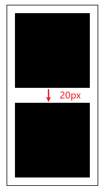

## 什么是 BFC

块级格式化上下文（Block Formatting Context，BFC），其实是块级盒子的布局过程发生的区域，在这个区域内会有特定的布局规则。实际上他相当于一个**结界**：如果一个元素具有 BFC，那么内部子元素无法影响外部的元素。

## 触发 BFC

触发 BFC 的 CSS 属性：

* `<html>` 根元素
* 浮动元素：`float: left | right`
* `overflow` 值不为 `visible`、`clip` 的块元素：`overflow: hidden | scoll | auto`
* 绝对定位元素：`position: absolute | fixed`
* `display: inline-block | table-cell | flex | table-caption | inline-flex`

## BFC 的布局规则

**BFC 相当于一个独立块级容器，容器内的元素不会影响外部元素**，具体规则如下：

* BFC 内的子元素以正常流排列；
* BFC 内的**子元素**垂直方向的外边距会发生重叠，但是可以利用 BFC 包裹元素消除外边距重叠（如果不能消除外边距重叠问题，则会影响外部元素布局）；
* BFC 元素计算高度时，浮动元素也参与计算。因此可以用来清除浮动（如果不能清除，子元素浮动则父元素高度塌陷，会影响后面元素的布局）。

后面两条规则都是由于 BFC 的**结界**特性，常用来解决外边距重叠、浮动高度塌陷的问题。

所以 BFC 的核心规则就是：**容器内的元素不会影响外部元素**。

下面一一举例验证这些规则。

### BFC 内的子元素以正常流排列

`<html>` 根元素是最大的 BFC，它内部元素的布局是以正常流排列的，因此非常容易验证。

### margin 重叠

#### 子元素的外边距会发生重叠

很简单，`<html>` 根元素就是最大的 BFC，在里面布局当然会发生外边距重叠。块的上外边距（margin-top）和下外边距 （margin-bottom）会合并为单个边距，其大小为两个外边距中的最大值。

```html
<div class="container">
  <div class="box box1"></div>
  <div class="box box2"></div>
</div>
```

```css
* {
  margin: 0;
  padding: 0;
}

.container {
  border: 1px solid #000;
  width: 120px;
  margin: 20px auto;
}

.box {
  width: 100px;
  height: 100px;
  background: #000;
  margin: 10px;
}

.box1 {
  margin-bottom: 10px;
}

.box2 {
  margin-top: 20px;
}
```

在这个例子中，为了看清两个子元素的外边距折叠问题，给父元素设置为宽 120px，边框 1px 黑色，第一个盒子设置了 10px 的 margin-bottom，第二个盒子设置为 20px 的 margin-top，两个盒子垂直外边距的值会取其中的最大值 20px。



#### BFC 消除外边距折叠

如果要消除这个影响，那么将第二个盒子包裹一个 wrapper，并将这个容器触发为 BFC，那么这个 wrapper 内的子元素则不会影响外部元素，当然也就消除了外边距折叠。

```html
<div class="container">
  <div class="box box1"></div>
  <div class="wrapper">
    <div class="box box2"></div>
  </div>
</div>
```

```css
/* ... */
.wrapper {
  overflow: hidden;
}
```

可以看到，在触发 BFC 后，两个盒子垂直方向外边距为 30px。


### 浮动

#### 浮动高度塌陷

当我们使用 float 布局时，会使元素脱离文档流，造成高度塌陷。

```html
<div class="container">
  <div class="box"></div>
  <div class="box"></div>
</div>
```

```css
* {
  margin: 0;
  padding: 0;
}

.container {
  border: 1px solid #000;
  width: 120px;
  margin: 0 auto;
}

.box {
  width: 100px;
  height: 100px;
  background: red;
  float: left;
  margin: 10px;
}
```

可以看到，由于给子元素设置了浮动，会造成父盒子高度塌陷。


#### BFC 清除浮动

如果要解决这个问题，可以给容器触发 BFC，则可以消除浮动的影响，就无需使用 `clear: both` 属性去清除浮动了。

```css
/* ... */
.container {
  border: 1px solid #000;
  width: 120px;
  margin: 0 auto;
  /* 触发 BFC */
  overflow: hidden;
}
```


## 两栏布局

```html
<div class="bfc">
  <div class="left">
    左边
  </div>
  <div>
    右边1 右边 右边 右边 右边 右边 右边 右边 右边 右边 右边 右边 右边 右边 右边 右边 右边 右边 右边 右边 右边 右边 右边 右边 右边 右边 右边 右边 右边 右边
  </div>
</div>
```

```css
* {
  margin: 0;
  padding: 0;
}

.bfc {
  overflow: hidden;
}

.left {
  float: left;
  width: 100px;
  background-color: #ccc;
}
```

可以看到，由于浮动的影响，会形成文字环绕的效果。


如果给右边盒子触发 BFC，那么就可以得到想要的效果了。

```diff
<div class="bfc">
  <div class="left">
    左边
  </div>
- <div> 
+ <div class="bfc">
    右边1 右边 右边 右边 右边 右边 右边 右边 右边 右边 右边 右边 右边 右边 右边 右边 右边 右边 右边 右边 右边 右边 右边 右边 右边 右边 右边 右边 右边 右边
  </div>
</div>
```


## 常见触发方式的优缺点

* `float: left | right`：浮动元素能够形成 BFC，但是浮动元素本身具有破坏性，无法用来实现自动填满容器的自适应布局。
* `position: absolute | fixed`：脱离文档流，一般用来和相对定位配合做布局，不太适合触发 BFC。
* `overflow: hidden`：本身还是一个普通的元素，并没有脱离文档流，兼容性也不错，**推荐使用**。