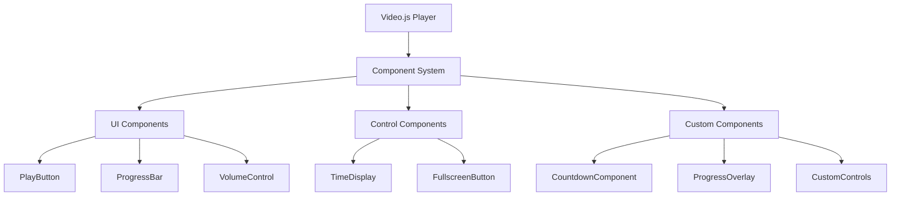
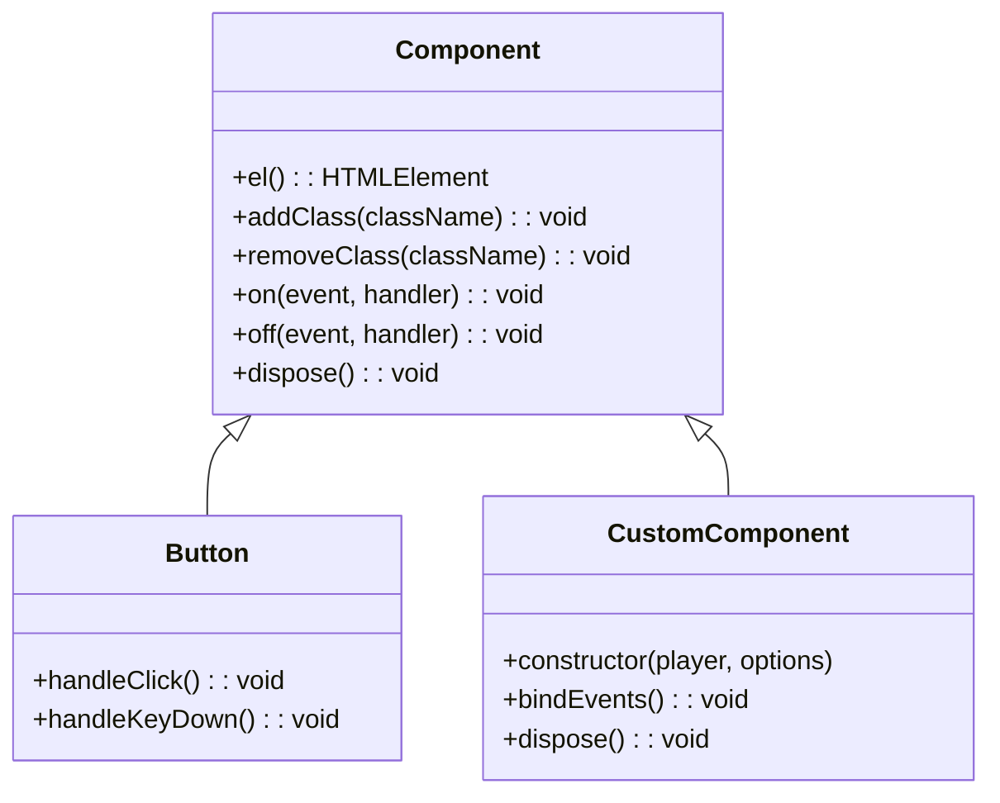
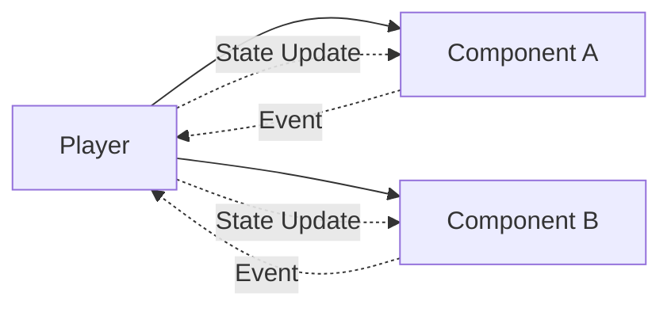
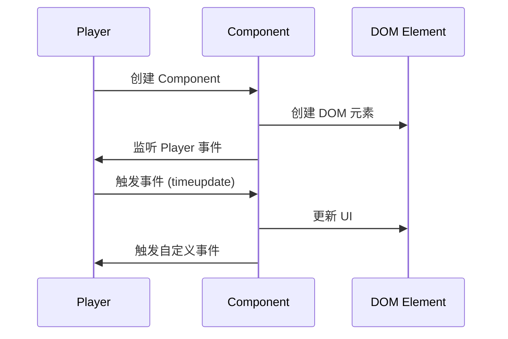
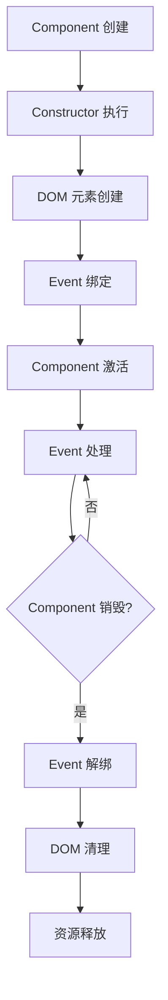

## **Video.js Component 基础概念**

### 什么是 Video.js Component？

Video.js Component 是基于 Video.js Player 框架的可扩展 UI 元素，用于增强视频播放器的功能和用户体验。每个 Component 都是独立的、可重用的模块。



### Component 继承关系



### 核心 API

```tsx
// 基础 Component 类
class MyComponent extends videojs.getComponent('Component') {
  constructor(player: Player, options?: any) {
    super(player, options);
    // 初始化逻辑
  }

  // 获取 DOM 元素
  el(): HTMLElement

  // 添加/移除 CSS 类
  addClass(className: string): void
  removeClass(className: string): void

  // 事件绑定
  on(event: string, handler: Function): void
  off(event: string, handler: Function): void

  // 清理资源
  dispose(): void
}

```

---

## Component 设计理念

### 1. 单一职责原则

每个 Component 只负责一个特定功能，如：

- **Countdown Component**：只负责显示剩余时间
- **Progress Bar Component**：只负责显示播放进度
- **Progress Overlay Component**：只负责处理拖动交互

### 2. Component 通信模式



### 3. 事件驱动架构



---

## Component 生命周期



### 生命周期详解

1. **创建阶段**
    - Constructor 调用
    - DOM 元素创建
    - CSS 类添加
2. **激活阶段**
    - Event Listener 绑定
    - Player 事件订阅
    - Component 功能启用
3. **运行阶段**
    - Event 处理
    - UI 更新
    - State 同步
4. **销毁阶段**
    - Event 解绑
    - DOM 元素移除
    - 内存清理

---

## 实战案例：Countdown Component

### 功能需求

显示视频剩余播放时间，实时更新倒计时显示。

### 实现代码

```tsx
import videojs from 'video.js';
import type Player from 'video.js/dist/types/player';
import { formatTime } from '@/pages/oral-class-report/utils/time';

class CountdownComponent extends videojs.getComponent('Component') {
  private readonly countdownElement: HTMLElement;
  private countdown: number;

  constructor(player: Player, options?: any) {
    super(player, options);
    this.countdown = 0;
    this.countdownElement = document.createElement('div');
    this.countdownElement.className = 'vjs-countdown';
    this.countdownElement.textContent = formatTime(this.countdown);

    this.addClass('vjs-countdown-component');
    this.el().appendChild(this.countdownElement);

    player.on('loadedmetadata', this.handleLoadedMetadata);
    player.on('timeupdate', this.handleTimeUpdate);
  }

  private readonly handleLoadedMetadata = () => {
    this.countdown = this.player().duration() ?? 0;
    this.updateCountdown();
  };

  private readonly handleTimeUpdate = () => {
    const currentTime = this.player().currentTime() ?? 0;
    const duration = this.player().duration() ?? 0;
    this.countdown = Math.max(0, duration - currentTime);
    this.updateCountdown();
  };

  private readonly updateCountdown = () => {
    this.countdownElement.textContent = formatTime(this.countdown);
  };

  dispose() {
    this.player().off('loadedmetadata', this.handleLoadedMetadata);
    this.player().off('timeupdate', this.handleTimeUpdate);
    super.dispose();
  }
}

videojs.registerComponent('CountdownComponent', CountdownComponent);

export default CountdownComponent;
```

### 技术要点

1. **Event 监听**：监听 `loadedmetadata` 和 `timeupdate` 事件
2. **DOM 操作**：动态创建和更新倒计时显示元素
3. **State 管理**：维护倒计时数值状态
4. **资源清理**：在 `dispose()` 中解绑事件

---

## 实战案例：Progress Bar Component

### 功能需求

显示视频播放进度，支持平滑更新，在拖动时暂停自动更新。

### 实现代码

```tsx
import videojs from 'video.js';
import type Player from 'video.js/dist/types/player';

const UPDATE_REFRESH_INTERVAL = 30;

class ProgressBar extends videojs.getComponent('Component') {
  private readonly progressBar: HTMLDivElement;
  private updateInterval: number | null = null;
  private isDragging = false;

  constructor(player: Player, options?: any) {
    super(player, options);

    this.progressBar = document.createElement('div');
    this.progressBar.className = 'vjs-progress-bar';

    this.addClass('vjs-progress-bar-container');
    this.el().appendChild(this.progressBar);

    this.bindEvents();
  }

  //#region 事件绑定
  private bindEvents(): void {
    this.player().on('timeupdate', this.handleTimeUpdate);

    // 平滑进度条
    this.player().on('playing', this.enableInterval);
    this.player().on(['ended', 'pause', 'waiting'], this.disableInterval);

    // 监听页面可见性变化
    if ('hidden' in document && 'visibilityState' in document) {
      document.addEventListener(
        'visibilitychange',
        this.handleVisibilityChange
      );
    }
  }
  //#endregion

  //#region 进度条平滑更新
  private readonly handleTimeUpdate = (): void => {
    if (this.isDragging) return;

    const currentTime = this.player().currentTime() ?? 0;
    const duration = this.player().duration() ?? 0;
    if (duration > 0) {
      const percent = (currentTime / duration) * 100;
      this.updateProgress(percent);
    }
  };

  updateProgress = (percent: number): void => {
    this.progressBar.style.width = `${percent}%`;
  };

  // 设置拖动状态，暂停自动更新
  setDragging = (dragging: boolean): void => {
    this.isDragging = dragging;
    if (dragging) {
      this.disableInterval();
    } else {
      if (!this.player().ended() && !this.player().paused()) {
        this.enableInterval();
      }
    }
  };

  private readonly handleVisibilityChange = (): void => {
    if (document.visibilityState === 'hidden') {
      this.disableInterval();
    } else {
      if (
        !this.player().ended() &&
        !this.player().paused() &&
        !this.isDragging
      ) {
        this.enableInterval();
      }
      this.handleTimeUpdate();
    }
  };

  private readonly enableInterval = (): void => {
    if (this.updateInterval || this.isDragging) {
      return;
    }
    this.updateInterval = this.setInterval(
      this.handleTimeUpdate,
      UPDATE_REFRESH_INTERVAL
    );
  };

  private readonly disableInterval = (): void => {
    if (this.updateInterval) {
      this.clearInterval(this.updateInterval);
      this.updateInterval = null;
    }
  };
  //#endregion

  //#region 清理函数
  dispose(): void {
    this.player().off('timeupdate', this.handleTimeUpdate);
    this.player().off('playing', this.enableInterval);
    this.player().off(['ended', 'pause', 'waiting'], this.disableInterval);

    if ('hidden' in document && 'visibilityState' in document) {
      document.removeEventListener(
        'visibilitychange',
        this.handleVisibilityChange
      );
    }

    this.disableInterval();

    super.dispose();
  }
  //#endregion
}

videojs.registerComponent('ProgressBar', ProgressBar);

export default ProgressBar;
```

### 技术要点

1. **平滑更新**：使用 `setInterval` 实现 30ms 间隔的平滑更新
2. **拖动状态管理**：通过 `isDragging` 状态控制是否自动更新
3. **性能优化**：在页面不可见时暂停更新
4. **外部控制**：提供 `setDragging()` 方法供外部 Component 调用

---

## 实战案例：Progress Overlay Component

### 功能需求

实现拖动进度条功能，拖动过程中继续播放，只更新进度条显示，拖动结束时才真正 seek。

### 实现代码

```tsx
import videojs from 'video.js';
import type Player from 'video.js/dist/types/player';
import ProgressBar from './ProgressBar';

const UPDATE_REFRESH_INTERVAL = 30;

class ProgressOverlay extends videojs.getComponent('Component') {
  private readonly playIcon: HTMLImageElement;
  private isDragging = false;
  private isPlaying = false;
  private startX = 0;
  private totalWidth = 0;
  private totalDuration = 0;
  private updateInterval: number | null = null;
  private dragStartTime = 0;

  constructor(player: Player, options?: any) {
	  // 合并 options，让 videojs 能正确注册组件
    options = videojs.obj.merge(ProgressOverlay.prototype.options_, options);

    super(player, options);

    this.emitTapEvents();

    player.on('loadedmetadata', () => {
      this.totalDuration = player.duration() ?? 0;
    });

    this.playIcon = document.createElement('img');
    this.playIcon.src = options.playIcon;
    this.playIcon.className = 'vjs-play-icon';
    this.el().appendChild(this.playIcon);

    this.addClass('vjs-progress-overlay');

    this.bindEvents();
  }

  //#region 事件绑定
  private bindEvents(): void {
    this.on('tap', this.handleTogglePlay);

    this.player().on('play', this.handlePlay);
    this.player().on('pause', this.handlePause);

    // 触摸事件支持
    this.on('touchstart', this.handleTouchStart as EventListener);
    this.on('touchmove', this.handleTouchMove as EventListener);
    this.on('touchend', this.handleTouchEnd as EventListener);
  }
  //#endregion

  //#region 播放相关
  private readonly handleTogglePlay = (): void => {
    console.log('tap');
    this.isDragging = false;
    this.player().trigger('togglePlay');
  };

  private readonly handlePlay = (): void => {
    this.playIcon.style.display = 'none';
    this.el().setAttribute('style', 'touch-action: none;');
    this.isPlaying = true;
  };

  private readonly handlePause = (): void => {
    this.playIcon.style.display = 'block';
    this.el().setAttribute('style', 'touch-action: auto;');
    this.isPlaying = false;
  };
  //#endregion

  //#region 拖动进度
  private readonly handleTouchStart = (event: TouchEvent): void => {
    if (!this.isPlaying) return;
    console.log('handleTouchStart');
    this.isDragging = true;

    this.totalWidth = this.currentWidth();
    this.startX = event.touches[0].clientX;
    this.dragStartTime = this.player().currentTime() ?? 0;

    (this.getChild('ProgressBar') as ProgressBar).setDragging(true);
  };

  private readonly handleTouchMove = (event: TouchEvent): void => {
    if (!this.isDragging) return;

    const percent = this.calculatePercent(event.touches[0]);

    console.log('touchmove percent', percent, event);

    // 只更新进度条，不真正 seek
    (this.getChild('ProgressBar') as ProgressBar).updateProgress(percent);
  };

  private readonly handleTouchEnd = (event: TouchEvent): void => {
    if (!this.isDragging) return;

    const percent = this.calculatePercent(event.changedTouches[0]);

    this.isDragging = false;

    console.log('handleTouchEnd', percent, event);
    // 拖动结束时才真正 seek
    this.seekToPercent(percent);

    (this.getChild('ProgressBar') as ProgressBar).setDragging(false);
  };

  private calculatePercent(touch: Touch): number {
    if (!this.isDragging) return 0;

    const currentX = touch.clientX;
    const dx = currentX - this.startX;
    const deltaX = dx / this.totalWidth;
    // 使用拖动开始时的播放时间作为基准
    const currentSeconds = this.dragStartTime;

    const newTime = currentSeconds + deltaX * this.totalDuration;
    // 确保时间在有效范围内
    const clampedTime = Math.max(0, Math.min(newTime, this.totalDuration));

    return (clampedTime / this.totalDuration) * 100;
  }

  private readonly seekToPercent = (percent: number): void => {
    if (this.totalDuration > 0) {
      const time = (percent / 100) * this.totalDuration;
      this.player().currentTime(time);
    }
  };
  //#endregion

  //#region 清理函数
  dispose(): void {
    this.off('tap', this.handleTogglePlay);

    this.off('touchstart', this.handleTouchStart as EventListener);
    this.off('touchmove', this.handleTouchMove as EventListener);
    this.off('touchend', this.handleTouchEnd as EventListener);

    if (this.updateInterval) {
      this.clearInterval(this.updateInterval);
      this.updateInterval = null;
    }

    super.dispose();
  }
  //#endregion
}

ProgressOverlay.prototype.options_ = {
  children: ['ProgressBar'],
  playIcon: '',
};

videojs.registerComponent('ProgressOverlay', ProgressOverlay);

export default ProgressOverlay;
```

### 技术要点

1. **拖动状态管理**：记录拖动开始位置和时间
2. **进度计算**：基于拖动距离计算目标进度
3. **边界保护**：确保进度值在有效范围内
4. **Component 协作： `merge`** 与 Progress Bar Component 配合实现平滑体验

## 使用

```tsx
import Countdown from './components/Countdown';
import ProgressOverlay from './components/ProgressOverlay';
import './components/ProgressBar'; // 必须导入，videojs 才能正确注册组件

const player = (playerRef.current = videojs(videoElement, options, () => {
  player.addChild(new Countdown(player));
  player.addChild(
    new ProgressOverlay(player, {
      playIcon: playBtn,
    })
	);
}));
```

---

## 总结

1. **基础概念**：Component 继承体系、生命周期、Event 系统
2. **设计原则**：单一职责、事件驱动、组件通信
3. **技术要点**：DOM 操作、Event 管理、State 同步、性能优化
4. **实战经验**：移动端适配、错误处理、资源清理

通过合理运用这些技术，可以开发出功能强大、性能优异的自定义 Video.js Component。