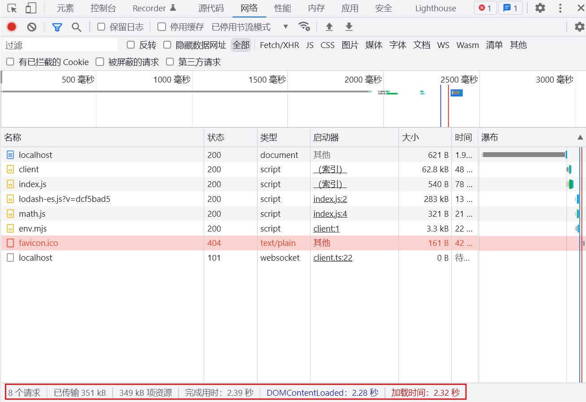

> [项目地址](https://github.com/Stephen-wzw/vite-demo)

通过前面对 webpack 的学习，我们已经看到了它的强大，为什么还需要学习 Vite 呢？

Vite 官方文档中提到，当我们开始构建越来越大型的应用时，需要处理的 JavaScript 代码量也呈指数级增长。包含数千个模块的大型项目相当普遍。我们开始遇到性能瓶颈 —— 使用 JavaScript 开发的工具通常需要很长时间（甚至是几分钟！）才能启动开发服务器，即使使用 HMR，文件修改后的效果也需要几秒钟才能在浏览器中反映出来。如此循环往复，迟钝的反馈会极大地影响开发者的开发效率和幸福感。

事实也确实如此，webpack 虽好，但是每次重新打包或者热更新都需要比较长的时间，同时还需要繁琐的配置，每次使用 loader 或者 plugin 都需要写上配置文件。

Vite 给我们提供了开箱即用的配置，同时它也具有高度的可扩展性，并有完整的类型支持。它主要由两部分组成：

* 一个开发服务器，它基于**原生 ES 模块**提供了丰富的内建功能，如速度快到惊人的模块热更新（HMR）。
* 一套构建指令，它使用 Rollup 打包你的代码，并且它是预配置的，可输出用于生产环境的高度优化过的静态资源。

## 开始

新建项目，初始化 npm，然后本地安装 `vite`。

```bash
mkdir vite-demo
cd vite-demo
npm init -y
npm install vite -D
```

创建以下目录及文件：

**project**

```diff
  vite-demo
  |- package.json
  |- package-lock.json
+ |- index.html
+ |- /src
+   |- /js
+     |- math.js
+   |- index.js
```

**src/js/math.js**

```js
export function sum(num1, num2) {
  return num1 + num2;
}
```

**src/index.js**

```js
import { sum } from "./js/math.js";

console.log("Hello Vite!");
console.log(sum(10, 20));
```

**index.html**

```html
<!DOCTYPE html>
<html lang="en">
<head>
  <meta charset="UTF-8">
  <meta http-equiv="X-UA-Compatible" content="IE=edge">
  <meta name="viewport" content="width=device-width, initial-scale=1.0">
  <title>vite-demo</title>
</head>
<body>
  <script src="./src/index.js" type="module"></script>
</body>
</html>
```

现在用 `live server` 打开 `index.html` 文件，即可看到浏览器显示正确的内容：

```bash
Hello Vite!
30
```

但其实我们现在并没有使用 Vite 帮我们打包项目，它起作用的原因在于浏览器本身就支持**原生 ES 模块**。既然这样，我们直接写 ES Module 的代码就行，为什么还需要使用到 Vite 呢？接下来看看直接使用 ES Module 的问题所在。

## 原生 ES 模块的问题

为了体现原生 ES 模块的问题，安装 `lodash-es` 库，它是使用 ES Module 导出的。

```bash
npm install lodash-es
```

接下来在 `src/index.js` 中使用：

```diff
+ import _ from "lodash-es";
  
  import { sum } from "./js/math.js";
  
  console.log("Hello Vite!");
  console.log(sum(10, 20));
+ console.log(_.join(["hello", "vite"], "-"));
```

这时打开 `index.html` 会报错：

```bash
Uncaught TypeError: Failed to resolve module specifier "lodash-es". Relative references must start with either "/", "./", or "../".
```

之前在 webpack 中可以直接这样导入模块的原因是它内部帮我们做了[模块解析](../webpack/008-webpack-resolve.md)。其实 Vite 也帮我们做了这样的事，但是为了体现**原生 ES Module**存在的问题，使用相对路径对其进行导入。

```diff
- import _ from "lodash-es";
+ import _ from "../node_modules/lodash-es/lodash.default.js";
```

重新打开浏览器正常工作：

```bash
Hello Vite!
30
hello-vite
```

但是，我们查看网络，可以看到浏览器将整个库都请求下来了，如果每个库都这样，那请求的资源将不可想象。


现在我们更改下模块路径，并使用 `vite` 启动服务：

**src/index.js**

```diff
- import _ from "../node_modules/lodash-es/lodash.default.js";
+ import _ from "lodash-es";
```

```bash
npx vite

vite v2.9.9 dev server running at:

> Local: http://localhost:3000/
> Network: use `--host` to expose

ready in 547ms.
```

用浏览器打开并查看网络，请求数极大减少，这是由于 Vite 帮我们在内部做了处理。



## css

### 普通 css

导入 .css 文件将会把内容插入到 `<style>` 标签中，同时也带有 HMR 支持。

在 src 下新建 css 文件夹，并新增 `style.css` 文件：

**src/css/style.css**

```css
body {
  background-color: #eee;
}
```

**src/index.js**

```diff
  import _ from "lodash-es";
  import { sum } from "./js/math.js";
 
+ import "./css/style.css";
 
  console.log("Hello Vite!");
  console.log(sum(10, 20));
  console.log(_.join(["hello", "vite"], "-"));
```

打开浏览器可以看到 `.css` 样式生效。

### 预处理器

Vite 也同时提供了对 .scss, .sass, .less, .styl 和 .stylus 文件的内置支持。没有必要为它们安装特定的 Vite 插件，但必须安装相应的预处理器依赖：

```bash
# .scss and .sass
npm add -D sass

# .less
npm add -D less

# .styl and .stylus
npm add -D stylus
```

以 less 为例，在 src/css 文件夹下新建 `title.less` 文件：

**title.less**

```less
@fontSize: 50px;
@fontColor: #999;

.title {
  font-size: @fontSize;
  color: @fontColor;
  
  user-select: none;
}
```

**src/index.js**

```diff
  import _ from "lodash-es";
  import { sum } from "./js/math.js";
 
  import "./css/style.css";
+ import "./css/title.less";

  console.log("Hello Vite!");
  console.log(sum(10, 20));
  console.log(_.join(["hello", "vite"], "-"));

+ const titleEl = document.createElement('div');
+ titleEl.className = "title";
+ titleEl.innerHTML = "Hello Vite";

+ document.body.appendChild(titleEl);
```

打开浏览器可以看到 `.less` 样式生效。

### postcss

如果项目包含有效的 PostCSS 配置 (任何受 postcss-load-config 支持的格式，例如 `postcss.config.js`)，它将会自动应用于所有已导入的 CSS。

首先安装 postcss 和 postcss-preset-env：

```bash
npm install postcss postcss-preset-env -D
```

在项目根目录下新建 `postcss.config.js`：

**postcss.config.js**

```js
module.exports = {
  plugins: [
    require("postcss-preset-env")
  ]
}
```

这时候打开浏览器查看元素，可以发现已经帮助我们加上了前缀：

```css
.title {
  font-size: 50px;
  color: #999;
  -webkit-user-select: none;
     -moz-user-select: none;
      -ms-user-select: none;
          user-select: none;
}
```

## 图片

在 src 下新建 img 文件夹，并修改 `index.js` 文件：

**index.js**

```diff
  import _ from "lodash-es";
  import { sum } from "./js/math.js";
  
  import "./css/style.css";
  import "./css/title.less";

+ import avatarUrl from "./img/avatar.png";
  
  console.log("Hello Vite!");
  console.log(sum(10, 20));
  console.log(_.join(["hello", "vite"], "-"));
  
  const titleEl = document.createElement('div');
  titleEl.className = "title";
  titleEl.innerHTML = "Hello Vite";
  
+ const imgEl = document.createElement('img');
+ imgEl.src = avatarUrl;
  
  document.body.appendChild(titleEl);
+ document.body.appendChild(imgEl);
```

不用其他配置，浏览器就已经显示出了图片。

## TypeScript

Vite 使用 [esbuild](https://github.com/evanw/esbuild) 将 TypeScript 转译到 JavaScript，约是 tsc 速度的 20~30 倍，同时 HMR 更新反映到浏览器的时间小于 50ms。

src 下新建 ts 文件夹，并新增 `mul.ts` 文件，在 `index.js` 下使用：

**src/ts/mul.ts**

```ts
export default function(num1: number, num2: number): number {
  return num1 * num2;
}
```

**src/index.js**

```diff
  import _ from "lodash-es";
  import { sum } from "./js/math.js";
+ import mul from "./ts/mul.ts";

  import "./css/style.css";
  import "./css/title.less";

  import avatarUrl from "./img/avatar.png";
  
  console.log("Hello Vite!");
  console.log(sum(10, 20));
  console.log(_.join(["hello", "vite"], "-"));
+ console.log(mul(10, 20));
  
  const titleEl = document.createElement('div');
  titleEl.className = "title";
  titleEl.innerHTML = "Hello Vite";
  
  const imgEl = document.createElement('img');
  imgEl.src = avatarUrl;
  
  document.body.appendChild(titleEl);
  document.body.appendChild(imgEl);
```

浏览器正确的打印了 `200`。

## Vue

Vite 为 Vue 提供第一优先级支持：

* Vue 3 单文件组件支持：@vitejs/plugin-vue
* Vue 3 JSX 支持：@vitejs/plugin-vue-jsx
* Vue 2 支持：underfin/vite-plugin-vue2

首先安装 vue@next 和 @vitejs/plugin-vue：

```bash
npm install vue@next @vitejs/plugin-vue -D
```

接下来对项目文件进行修改：

**index.html**

```diff
 <!DOCTYPE html>
 <html lang="en">
 <head>
   <meta charset="UTF-8">
   <meta http-equiv="X-UA-Compatible" content="IE=edge">
   <meta name="viewport" content="width=device-width, initial-scale=1.0">
   <title>vite-demo</title>
 </head>
 <body>
+  <div id="app"></div>
   <script src="./src/index.js" type="module"></script>
 </body>
</html>
```

**src/vue/App.vue**

```vue
<template>
  <div>
    <h2>{{message}}</h2>
  </div>
</template>

<script>
  export default {
    data() {
      return {
        message: "Hello Vue"
      }
    }
  }
</script>

<style scoped>
</style>
```

**src/index.js**

```diff
+ import { createApp } from "vue";
+ import App from './vue/App.vue';
 
  ...
 
+ createApp(App).mount('#app');
```

新建 `vite.config.js` 使用 @vitejs/plugin-vue 来处理 .vue 文件：

**vite.config.js**

```js
const vue = require('@vitejs/plugin-vue')

module.exports = {
  plugins: [
    vue()
  ]
}
```

## npm script

**package.json**

```diff
  "scripts": {
    "test": "echo \"Error: no test specified\" && exit 1",
+   "serve": "vite",
+   "build": "vite build",
+   "preview": "vite preview"
  },
```

* `vite`：启动服务。
* `vite build`：给项目进行打包。
* `vite preview`：打包后进行预览。

> 在进行 `npm run build` 打包后使用 `live server` 打开后页面显示空白，浏览器报错。需要在 `vite.config.js` 下配置 `base: './'`。

## 总结

通过上面的体验，可以发现 Vite 是真的很快，而且不需要像 webpack 那样大量的配置。

以前的打包模式，项目启动时，需要先将所有文件打包成一个文件 bundle.js ，然后在 html 引入，这个 多文件 -> bundle.js 的过程是非常耗时间的。


而 Vite 以原生 ESM 方式提供源码，Vite 只需要在浏览器请求源码时进行转换并按需提供源码。根据情景动态导入代码，即只在当前屏幕上实际使用时才会被处理。

