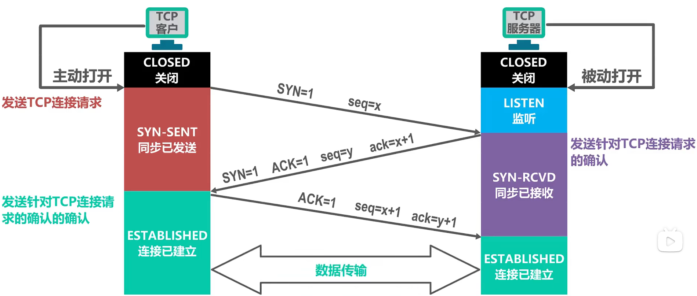
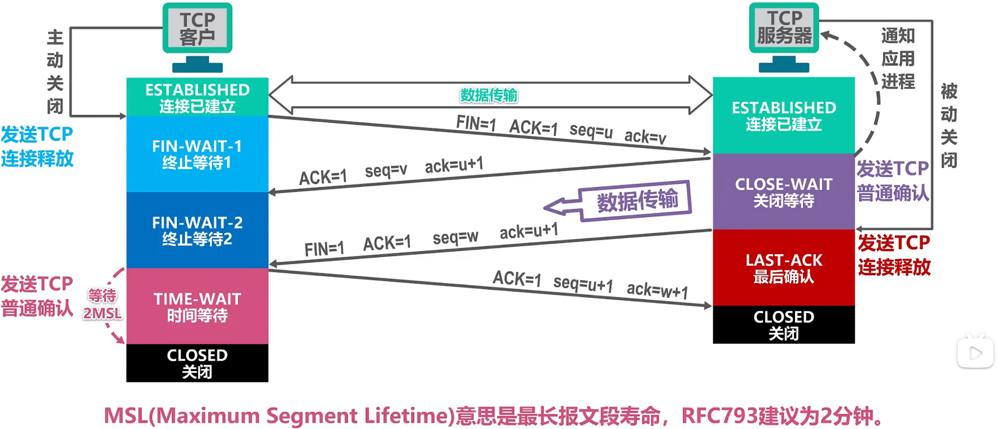

传输层控制协议（Transmission Control Protocol, TCP）是一种面向连接的、可靠的、基于字节流的传输层通信协议。

## 三次握手

三报文握手具体过程（客户端和服务端交换三个报文段）：

**第一次握手：**

起初两端都处于 `CLOSED` 关闭状态。一开始，服务器就进入监听状态，被动等待客户端的连接请求。

在打算建立 TCP 连接时，客户端将同步请求标志 `SYN=1` 和随机初始序号 `seq=x` 发送给服务器，客户端进入 `SYN-SENT` （同步已发送）状态，等待服务器确认。

**第二次握手：**

服务器收到数据包后由同步位 `SYN=1` 得知客户端请求建立连接。

服务器发送同步请求标志 `SYN=1`、确认标志 `ACK=1`、随机初始序号 `seq=y` 以及确认号字段 `ack=x+1`，发送给客户端，并进入 `SYN-RCVD` （同步已接收）状态。

**第三次握手：**

客户端收到确认后，检查 `ack` 是否为 `x+1`，`ACK` 是否为 `1`，如果正确则发送确认标志 `ACK=1`、序号 `seq=x+1` 以及确认号 `ack=y+1`，并进入连接已建立状态 `ESTABLISHED`。

服务器收到消息后，检查 `ack` 是否为 `y+1`，`ACK` 是否为 `1`，如果成功则建立连接。 进入连接已建立状态 `ESTABLISHED`。

**能否采用两报文握手？**

如果客户端发出连接请求，但因网络延迟而未收到确认，于是客户端再次发送一个连接请求，服务端收到确认，由于是两次握手，此时就会建立连接，等数据传输完毕后，释放连接。

此时第一个请求报文经过一段时间到达服务端，于是服务端收到确认，由于采用两次握手，此时就已同意建立连接，客户端不需要对服务端的确认报文发出响应，也不继续发送数据，导致连接一直建立，浪费资源。

## 四次挥手

四报文挥手来释放连接（现二者均处于连接已建立状态，假设客户端主动关闭 TCP 连接）：

**第一次挥手：**

客户端发送 TCP 连接释放报文段，并进入**终止等待 1 状态**。

该报文段首部种的终止位 FIN 和确认位 ACK 都设置为 1 ，表明这是一个 TCP 连接释放报文段，同时也对之前收到的报文段进行确认。

序号 seq = u，它等于之前客户端已经传送过的数据的最后一个字节的序号加 1 。确认号 ack 的值设置为 v ，它等于 TCP 客户进程之前已收到的数据的最后一个字节的序号加 1 。

**第二次挥手：**

服务端收到连接释放报文段后，会发送一个普通的 TCP 确认报文段并进入**关闭等待状态**。

该报文段首部中的确认位 ACK 被设置为 1；seq 设置为 v，它等于服务端之前已传送过的数据的最后一个字节的序号加 1 。确认号 ack 字段的值被设置为 u + 1，这是对连接释放报文的确认。

这个时候，客户端不能给服务端发送信息报文，只能接收。但是服务端要是还有信息要传给客户端，仍能传送。

**第三次挥手：**

客户端收到确认报文段后就进入**终止等待 2 状态**，当服务器数据发送完毕后，给客户端发送 TCP 连接释放报文段并进入**最后确认状态**。

该报文段首部中的终止位 FIN 和确认位 ACK 的值都设置为 1 ，seq = w ，ack = u + 1 。

**第四次挥手：**

客户端收到连接释放报文段后，需要向服务端发送 TCP 确认报文段，并进入**时间等待状态**。

首部中的确认位 ACK = 1 ，seq = u + 1 ，ack = w + 1 ，这是对 TCP 连接释放报文段的确认。

服务端 收到该报文后就进入**关闭状态**，而 客户端 还要经过 2MSL 后才能进入**关闭状态**。

> MSL，最长报文段寿命，一般为 2 分钟。

**为什么最后还要等待两个时间周期呢？**

* 客户端的最后一个ACK报文在传输的时候丢失，服务器并没有接收到这个报文。这个候时候服务器就会超时重传这个FIN消息，然后客户端就会重新返回最后一个ACK报文，等待两个时间周期，完成关闭。
* 如果不等待这两个时间周期，服务器重传的那条消息就不会收到。服务器就因为接收不到客户端的信息而无法正常关闭。

## 参考链接

[计算机网络微课堂](https://www.bilibili.com/video/BV1c4411d7jb)
