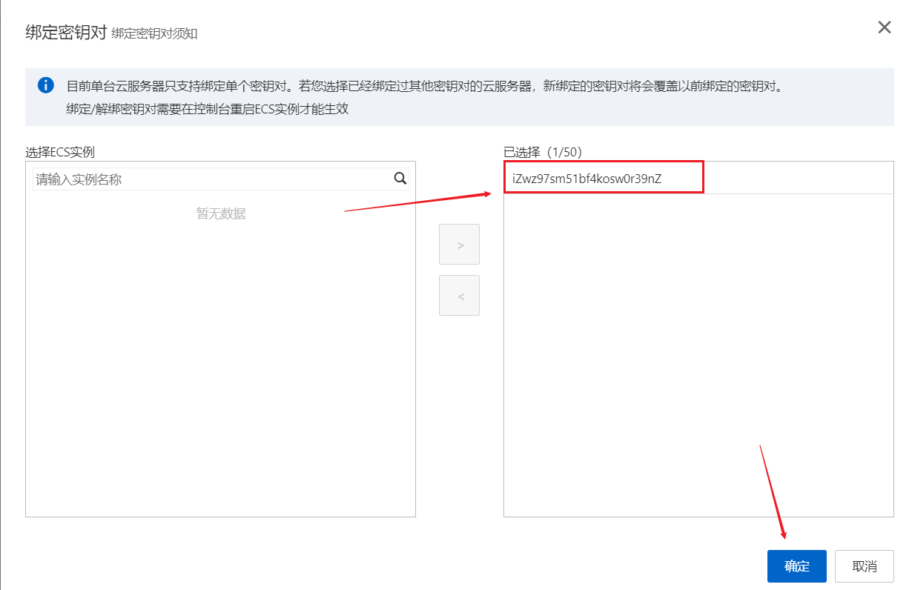
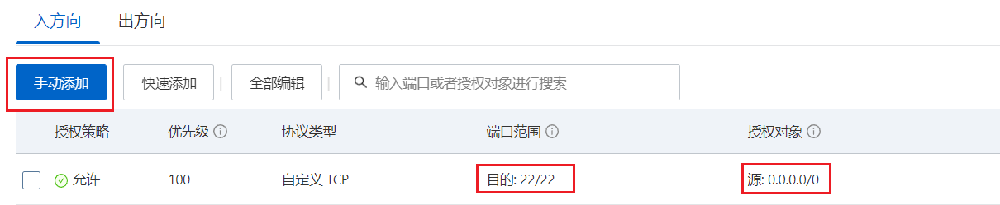

## 创建密钥对

登录阿里云控制台 -> 云服务 ECS -> 网络与安全 -> 密钥对 -> 创建密钥对


创建成功之后，浏览器会自动下载一个 `.pem` 私钥文件，记住这个文件的位置，之后要用。

## 绑定密钥对

选中刚才创建的密钥对，点击右侧**绑定密钥对**，将密钥对绑定到实例。



## 添加安全组规则

云服务 ECS -> 网络与安全 -> 安全组 -> 入方向 -> 手动添加



执行完后重启实例。

## 密钥验证并禁用密码登录

1. 安装 MobaXterm

2. 在 MobaXterm 下输入命令（[参考阿里云官网文档](https://help.aliyun.com/document_detail/51798.html#title-7je-5ba-sm2)）

   ```shell
   chmod 400 [.pem私钥文件在本地机上的存储路径]
   ```

   ```shell
   ssh -i [.pem私钥文件在本地机上的存储路径] root@[公网IP地址]
   ```

3. 输入以下命令修改 config 文件
   
   ```shell
   vi /etc/ssh/sshd_config
   ```

4. 按  `i`  进入编辑模式

   ```shell
   #禁用密码验证
   PasswordAuthentication no
   #启用密钥验证
   PubkeyAuthentication yes
   ```

5. 重启 ssh 服务

   ```shell
   service sshd restart
   ```

接下来在阿里云控制台使用 Workbench 远程连接，可以发现密码登录已经被禁用了，只能使用密钥登录：

